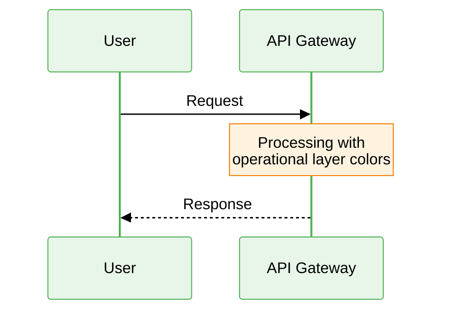

# AI Instructions - Diagrams as Code Toolkit

Universal AI instructions for creating Mermaid diagrams with semantic color system.

**Compatibility**: Works with Claude Code, Cursor, and other AI-powered editors supporting AGENTS.md spec.

---

## 🎯 Core Principles

When working with diagrams in this repository:

1. **Semantic over generic**: Use meaningful names (SessionStart, not A)
2. **Colors communicate meaning**: Operational=green, error=red, warning=yellow
3. **Consistency matters**: Same concepts same colors across diagrams
4. **Tool-agnostic foundation**: Color system works beyond just Mermaid

---

## 🎨 Semantic Color System

### ⚠️ CRITICAL: Color Application Strategy

**ALL diagram types MUST use theme configuration with semantic colors.**

| Diagram Type | Theme Required | Additional classDef |
|--------------|---------------|---------------------|
| `flowchart`/`graph` | ✅ **YES** | ✅ Optional (additional styling) |
| `sequenceDiagram` | ✅ **YES** | ❌ NO (not supported) |
| `classDiagram` | ✅ **YES** | ❌ NO (not supported) |
| `stateDiagram` | ✅ **YES** | ⚠️ Limited (normal states only, not [*] or composite) |
| `erDiagram` | ✅ **YES** | ❌ NO (not supported) |

**MANDATORY for ALL diagrams:**
```mermaid
%%{init: {
  'theme':'base',
  'themeVariables': { /* semantic colors here */ }
}}%%
```

**NEVER use `classDef` or `class` as primary coloring method.**
**ALWAYS start with theme configuration.**

**Note on State Diagrams**:
State diagrams support `classDef` and `:::` syntax with limitations:
- ✅ Works for normal states (e.g., `Idle:::info`, `Building:::warning`)
- ❌ Cannot apply to start/end states `[*]`
- ❌ Cannot apply to composite states
- ⚠️ May not work in older Mermaid versions (<10.0)
- **Recommendation**: Use theme configuration as primary method, `:::` as optional enhancement

**Reference**: https://mermaid.js.org/syntax/stateDiagram.html

### Apply colors based on MEANING, not aesthetics

**States/Conditions**:

- `operational` (#4CAF50 green): System working correctly, success paths
- `warning` (#FFC107 yellow): Attention needed, degraded, decision points
- `error` (#F44336 red): Failed, critical issues, error paths
- `info` (#2196F3 blue): Informational, neutral, entry points
- `inactive` (#9E9E9E gray): Disabled, unused, deprecated

**Architectural Layers**:

- `dataLayer` (blue light #E3F2FD): Input, sensors, data sources
- `processingLayer` (green light #E8F5E9): Business logic, transformation
- `storageLayer` (orange light #FFF3E0): Persistence, databases, caches
- `communicationLayer` (purple light #F3E5F5): APIs, messaging, protocols
- `presentationLayer` (cyan light #E0F2F1): UI, visualization, dashboards

**Priority Levels**:

- `critical` (red bg, 3px border): Critical systems, cannot fail
- `important` (orange bg, 2px border): Important but not critical
- `standard` (blue bg, 1px border): Standard components

---

## 📐 Diagram Type Selection

Choose diagram type based on what user wants to show:

| User Wants                    | Use Diagram Type | Why                                     | Template/Guide |
|-------------------------------|------------------|-----------------------------------------|----------------|
| Process/workflow steps        | Flowchart        | Shows sequential flow with decisions    | `/templates/flowchart-template.mmd` |
| System interactions over time | Sequence         | Shows who-calls-whom with timing        | `/templates/sequence-template.mmd` |
| Class/data structure          | Class            | Shows OOP relationships and inheritance | `/templates/class-template.mmd` |
| State transitions             | State            | Shows lifecycle and state changes       | `/templates/state-template.mmd` |
| Database schema               | ER               | Shows entities and relationships        | `/templates/er-template.mmd` |

**⚠️ IMPORTANT: Before creating any diagram:**

1. **CHECK the template** for that diagram type in `/templates/`
2. **REVIEW type-specific guide** in `/guides/mermaid/`
3. **VERIFY syntax limitations** in `/guides/mermaid/common-pitfalls.md`
4. **APPLY theme configuration** with semantic colors (MANDATORY for all types)
5. For flowchart/graph only **add classDef** (additional fine-grained styling)

---

## 🔤 Naming Conventions (STRICT)

### Node IDs (code-level)

**Language**: Always English
**Style**: PascalCase or camelCase, semantic

**Examples**:

- ✅ SessionStart, UserValidation, DataProcessor
- ❌ A, B, C, Nodo1, Nodo2, end, class

**Reserved keywords** (NEVER use as node IDs):

- `end`, `class`, `style`, `click`, `graph`, `subgraph`
- See `/guides/mermaid/common-pitfalls.md` for complete list

### User-Visible Text (labels)

**Language**: English by default (unless user specifies otherwise)

**Examples**:

- `SessionStart["Start session"]` ✅
- `UserValidation["Validate user"]` ✅

### Comments

**Language**: Always English

**Examples**:

```mermaid
%% Authentication flow
%% Handles login with 2FA
graph TD
%% ... diagram ...
```

**Note**: Comments are not rendered in diagrams; one comment needs a separate line (no inline comment is allowed)

---

## 🚫 Critical Pitfalls to Avoid

### 1. Reserved Keywords

```mermaid
%% ❌ BREAKS
graph TD
end[Finish]
%% "end" is reserved

%% ✅ WORKS
graph TD
Finish[Finish]
EndNode[End]  %% Capitalize works
```

### 2. Special Characters

```mermaid
%% ❌ PROBLEMATIC
graph TD
    A[Status: Active]
%% Colon may break

%% ✅ SAFE
    graph TD
    A["Status: Active"]  %% Always quote special chars
```

### 3. ClassDef Position

```mermaid
%% ❌ WRONG ORDER
graph TD
    classDef myClass fill: #f00  %% Before nodes
    A[Node]:::myClass
%% ✅ CORRECT ORDER
    graph TD
    A[Node]:::myClass
    classDef myClass fill: #f00  %% After nodes
```

### 4. Sequence Diagram Activation in alt/else Blocks

```mermaid
%% ❌ BREAKS - Deactivation in both branches
sequenceDiagram
    User->>+API: Request
    API->>+Service: Process

    alt Success
        Service-->>-API: OK
        API-->>-User: 200
    else Error
        Service-->>-API: Error  %% ❌ Already deactivated!
        API-->>-User: 500       %% ❌ Already deactivated!
    end

%% ✅ WORKS - No deactivation inside branches
sequenceDiagram
    User->>+API: Request
    API->>+Service: Process

    alt Success
        Service-->>API: OK
        API-->>User: 200
    else Error
        Service-->>API: Error
        API-->>User: 500
    end

    deactivate Service
    deactivate API

%% ✅ ALSO WORKS - No activation/deactivation
sequenceDiagram
    User->>API: Request
    API->>Service: Process

    alt Success
        Service-->>API: OK
        API-->>User: 200
    else Error
        Service-->>API: Error
        API-->>User: 500
    end
```

**Rule**: NEVER use `-` deactivation suffix inside `alt`/`else`/`loop`/`opt` blocks. Only one branch executes, so deactivation in the first branch prevents deactivation in other branches.

**Solutions**:
1. Deactivate AFTER the block ends (using explicit `deactivate` statements)
2. Don't use activation boxes at all (simpler diagrams)
3. Use activation only for critical processing steps, not full flows

---

## 🛠️ Available Tools

### Slash Commands (v0.2.0+)

- `/create-flowchart [description]` - Generate flowchart
- `/create-sequence [description]` - Generate sequence diagram
- `/apply-colors [file]` - Apply semantic colors
- `/validate-diagram [file]` - Validate syntax and conventions

**Location**: `.ai/commands/`

---

## 🎯 Core Behaviors

### 1. Proactive Diagram Creation

When user describes a process, system, or structure:

- Recognize it's diagrammable
- Suggest appropriate diagram type
- **CONSULT template and guide** for that diagram type FIRST
- Offer to create diagram
- Don't wait for explicit "create diagram" request

**Workflow:**

1. User describes system/process
2. Identify diagram type needed
3. **READ `/templates/{type}-template.mmd`** for syntax reference
4. **REVIEW `/guides/mermaid/common-pitfalls.md`** for that type
5. Create diagram following template + semantic color strategy
6. Validate before delivering

### 2. Semantic Color Application

**For ALL diagram types:**

- ✅ **ALWAYS** start with theme configuration (`%%{init: ...}%%`)
- ✅ Map semantic colors to appropriate themeVariables
- ✅ Explain color choices briefly
- ✅ Use colors to communicate meaning

**For flowchart/graph ONLY (optional additional styling):**

- ✅ Can add `classDef` for fine-grained node coloring (in addition to theme)
- ✅ Use `class` or `:::` to apply classes to specific nodes

**For other diagram types:**

- ❌ **NEVER** use `classDef` or `class` (not supported)
- ✅ Rely solely on theme configuration

**Example: ANY Diagram with Semantic Colors**



**Theme Variable Mapping to Semantic Colors:**

- `primaryColor`: Processing layer background (#E8F5E9)
- `primaryBorderColor`: Operational state (#4CAF50)
- `secondaryColor`: Data layer background (#E3F2FD)
- `tertiaryColor`: Error layer background (#FFEBEE)
- `lineColor`: Operational connections (#2E7D32)
- `noteBkgColor`: Warning background (#FFF3E0)
- `noteBorderColor`: Warning border (#F57C00)

### 3. Quality Enforcement

Before delivering any diagram:

- ✅ **MANDATORY**: Apply theme configuration with semantic colors (ALL diagram types)
- ✅ Validate syntax (no parsing errors)
- ✅ Check no reserved keywords used
- ✅ Verify semantic node names (not A, B, C)
- ✅ **For flowchart/graph ONLY**: Optional classDef for additional node styling
- ✅ **NEVER** use classDef/class in non-flowchart diagrams
- ✅ Special characters handled safely
- ✅ Comments in English, labels in specified language

### 4. Educational Approach

When helping users:

- Explain why certain syntax used
- Point out reserved keywords avoided
- Show color system reasoning
- **Reference specific template/guide** for the diagram type
- Teach conventions, don't just apply them

**Example response:**

> "I'm creating a sequence diagram following `/templates/sequence-template.mmd`. Since sequence diagrams don't support `classDef`, I'm using theme configuration to apply semantic colors (processing layer = green, data layer = blue)."

### 5. Iterative Refinement

For complex diagrams:

- Start with working simple version
- Get user feedback
- Iterate and refine
- Don't try to perfect in one shot
- Validate before final delivery

---

## 📚 Resources Available

- **Templates**: `/templates/` (flowchart, sequence, class, state)
- **Guides**: `/guides/mermaid/` (comprehensive references)
- **Examples**: `/examples/` (real-world use cases)
- **Common Pitfalls**: `/guides/mermaid/common-pitfalls.md`

---

## ✅ Quality Commitment

Every diagram created/modified must be:

- ✅ Syntactically valid (renders correctly)
- ✅ Convention-compliant (semantic names, colors)
- ✅ Well-commented (explains structure)
- ✅ Production-ready (no reserved keywords, safe chars)
- ✅ Educational (user learns, doesn't just receive)

---

*These instructions ensure all AI-generated diagrams follow conventions and use semantic color system correctly.*
