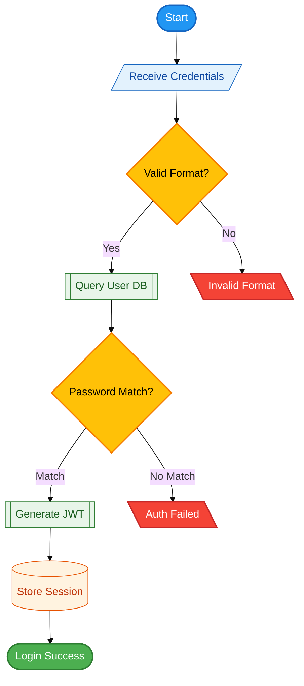

# Create Flowchart

Create a Mermaid flowchart diagram from natural language description.

## Instructions

When user invokes this command with a description:

1. **Analyze the description** to identify:
   - Main process steps
   - Decision points
   - Data inputs/outputs
   - Error handling paths

2. **Choose appropriate shapes**:
   - `([Terminal])` for start/end
   - `[Process]` for standard steps
   - `{Decision}` for decision points
   - `[/Input/]` for data inputs
   - `[\Output\]` for data outputs
   - `[(Storage)]` for databases

3. **Apply semantic colors automatically**:
   - Operational/success states: `:::operational` (green)
   - Decision points: `:::warning` (yellow)
   - Error handling: `:::error` (red)
   - Info/neutral: `:::info` (blue)
   - Architectural layers: `:::dataLayer`, `:::processingLayer`, etc.

4. **Use semantic node names** (English):
   - SessionStart, not A
   - UserValidation, not B
   - ErrorHandler, not X

5. **Add comments** explaining structure

6. **Include complete classDef** definitions at bottom

## Template Base

Use `/templates/flowchart.mmd` as starting point.

## Example

User request: "Create flowchart for user authentication process"

Output:

## Important

- Avoid reserved keywords (see guides/mermaid/common-pitfalls.md)
- Use semantic naming (English for node IDs)
- User-visible text can be in any language as specified
- Always include complete classDef block
