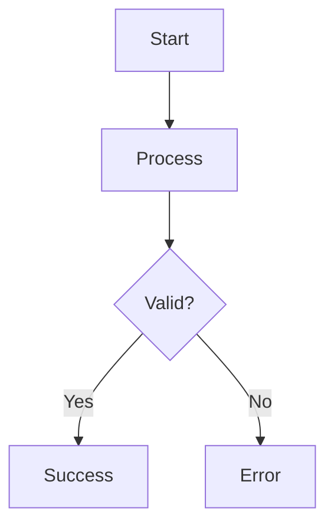
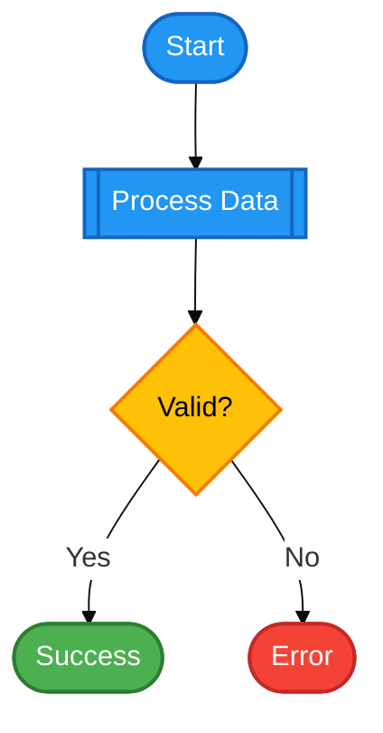
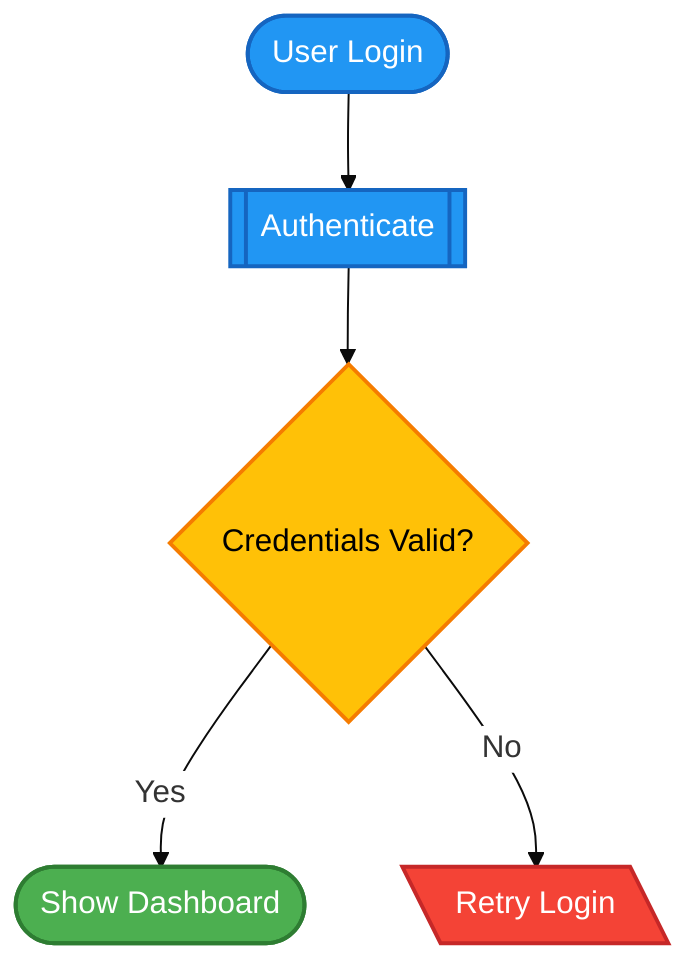
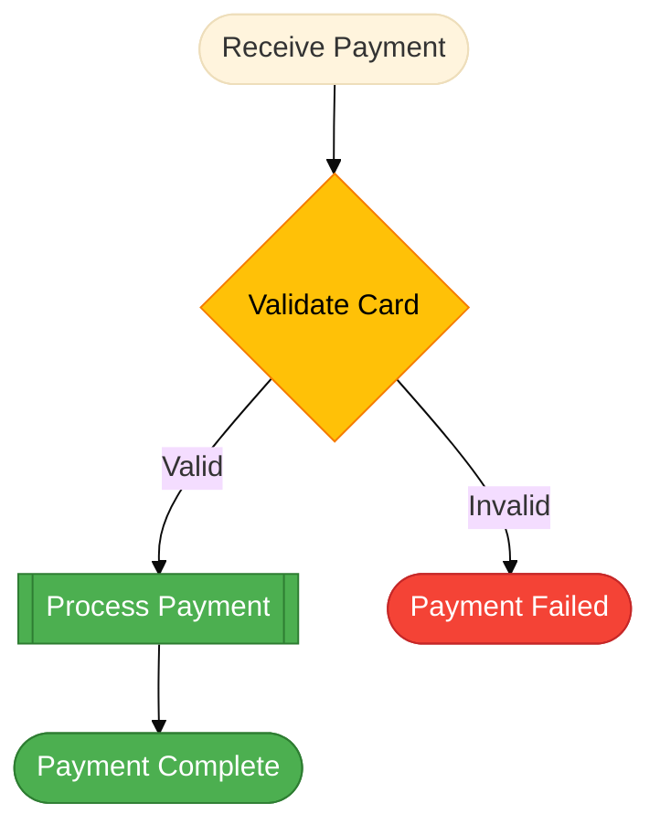
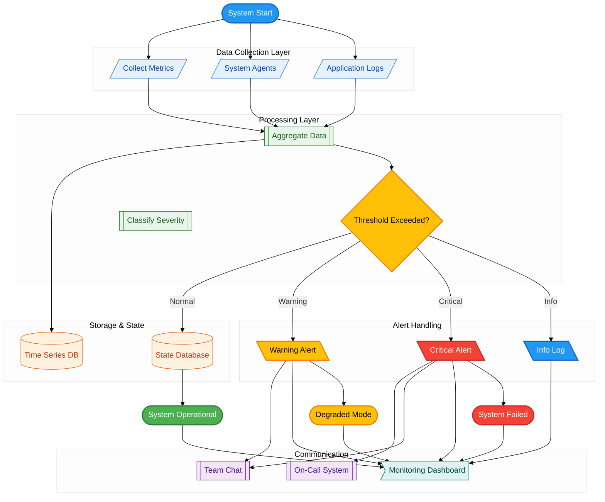
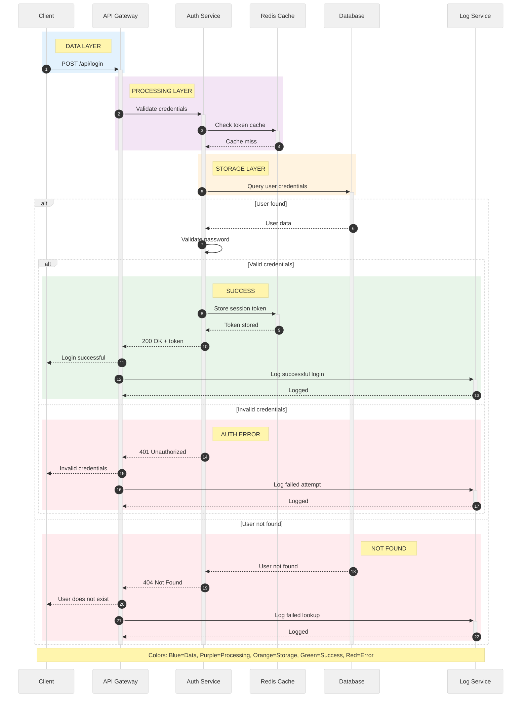
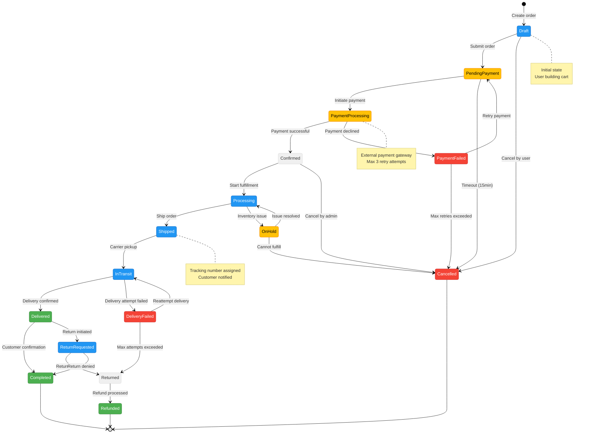
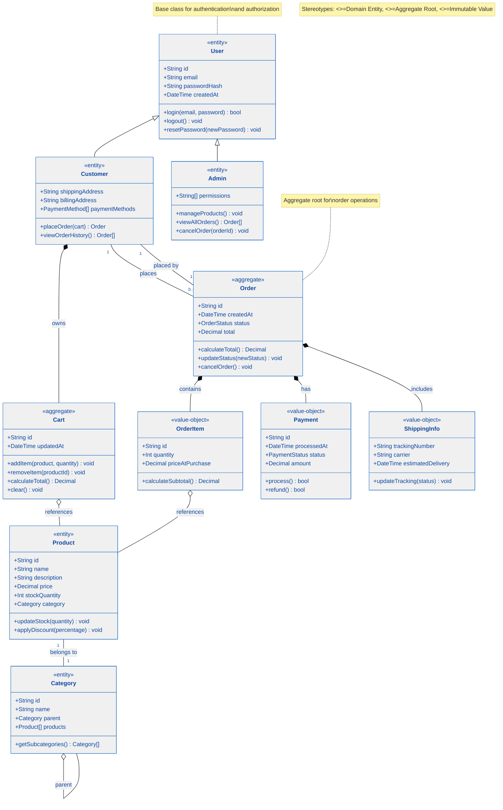

# AI Diagrams Toolkit

> **Professional Mermaid diagrams with semantic colors in 2 minutes**
> Stop fighting with CSS. Start building meaningful diagrams.

[](https://opensource.org/licenses/MIT)
[](CONTRIBUTING.md)
[](https://mermaid.js.org/)

---

## 🎯 What You Get

Transform this basic Mermaid diagram:



Into this **professional, semantic diagram**:



**The difference?**

- ✅ **Colors communicate meaning** (green = success, red = error, yellow = decision)
- ✅ **Professional appearance** (no default blue boxes)
- ✅ **Semantic naming** (Start, Process, not A, B, C)
- ✅ **Production-ready** (copy-paste and done)

---

## 🚀 5-Minute Tutorial

### Prerequisites

- A Mermaid-compatible
  editor ([GitHub](https://github.com), [VSCode with extension](https://marketplace.visualstudio.com/items?itemName=bierner.markdown-mermaid), [Mermaid Live Editor](https://mermaid.live))
- **Optional**: [Claude Code](https://claude.ai/code) or [Cursor](https://cursor.sh) for AI-powered generation

### Step 1: Copy Template

Navigate to [`/templates/flowchart.mmd`](./templates/flowchart.mmd) and copy the **entire file content** (including the
color definitions at the top).

### Step 2: Paste & Customize

Create `my-diagram.mmd` and paste the full template. Then, **replace only the diagram nodes** (lines 37-43) with your
own:

**Example customization:**



**Important**: Keep the `classDef` lines at the top! Only change the nodes and connections.

### Step 3: Render

Open in your Mermaid-compatible tool. **Done!** 🎉

**Time spent**: ~2 minutes
**Result**: Professional diagram with semantic colors

---

## 🎨 Semantic Color System

### Status Colors

Colors communicate **meaning** at a glance:

| Color         | Meaning              | Use For                                |
|---------------|----------------------|----------------------------------------|
| 🟢 **Green**  | Operational, success | Working processes, successful outcomes |
| 🔴 **Red**    | Error, failure       | Error handlers, failed states          |
| 🟡 **Yellow** | Warning, decision    | Decision points, requires attention    |
| 🔵 **Blue**   | Info, neutral        | Entry points, informational nodes      |
| ⚫ **Gray**    | Inactive, disabled   | Deprecated features, unused paths      |

### Architectural Layers

Light colors differentiate system layers:


- **Blue light** = Data layer (inputs, sensors)
- **Green light** = Processing layer (business logic)
- **Orange light** = Storage layer (databases)
- **Purple light** = Communication layer (APIs)
- **Cyan light** = Presentation layer (UI)

---

## 🤖 AI-Powered Generation (v0.2.0+)

**NEW**: Generate diagrams from natural language!

### Setup (One-time)

1. Install [Claude Code](https://claude.ai/code) or [Cursor](https://cursor.sh)
2. Clone this repo:
   ```bash
   git clone https://github.com/joserprieto/ai-diagrams-toolkit.git
   cd ai-diagrams-toolkit
   ```
3. Open in your AI editor

### Usage

Use slash commands to generate diagrams:

```bash
# Generate flowchart from description
/create-flowchart user authentication with email and password

# Generate sequence diagram
/create-sequence REST API with caching and database

# Apply semantic colors to existing diagram
/apply-colors my-existing-diagram.mmd

# Validate diagram syntax
/validate-diagram my-diagram.mmd
```

**Result**: AI generates production-ready Mermaid code with:

- ✅ Semantic color system applied
- ✅ Proper naming conventions
- ✅ No reserved keywords
- ✅ Comments explaining structure

### Example Output

**Your prompt**:

```bash
/create-flowchart payment processing with validation and error handling
```

**AI generates**:



---

## 📦 What's Included

```
ai-diagrams-toolkit/
├── templates/          # 4 ready-to-use templates
│   ├── flowchart.mmd   # Processes & workflows
│   ├── sequence.mmd    # API interactions
│   ├── class.mmd       # OOP structures
│   └── state.mmd       # State machines
├── examples/           # Real-world examples
│   ├── critical-system.md    # System monitoring
│   └── business-process.md   # Order fulfillment
├── guides/mermaid/     # Comprehensive guides
│   ├── flowchart.md
│   ├── sequence.md
│   ├── class.md
│   └── common-pitfalls.md
└── .ai/commands/       # AI slash commands
```

---

## 🎓 Learn More

### For Template Users

- **[Templates README](./templates/)** - Detailed guide for each template
- **[Examples](./examples/)** - Real-world use cases with explanations
- **[Common Pitfalls](./guides/mermaid/common-pitfalls.md)** - Avoid Mermaid gotchas

### For AI Users

- **[AI Commands Guide](.ai/AGENTS.md)** - Complete AI instructions
- **[Testing](./docs/development/testing-guide.md)** - Automated test suite

### For Contributors

- **[Contributing Guide](./CONTRIBUTING.md)** - How to contribute
- **[Architecture Docs](./docs/architecture/)** - Design decisions
- **[Roadmap](./ROADMAP.md)** - Future plans

---

## 🎨 Gallery - Real-World Examples

> See the semantic color system in action with production-ready diagrams

### 🏗️ Complex System Architecture

**Use case**: 24/7 Critical monitoring system with multiple layers and alert handling

<details>
<summary><b>Click to see diagram (30+ nodes)</b></summary>



**What it demonstrates**:
- ✅ Multiple architectural layers (data, processing, storage, communication, presentation)
- ✅ Complex error handling flows with different severity levels
- ✅ Subgraphs for logical grouping
- ✅ Real-world alerting system architecture
- ✅ 30+ nodes with semantic naming

</details>

### 🔄 API Sequence Diagram

**Use case**: REST API authentication with caching, database lookup, and error handling

<details>
<summary><b>Click to see diagram</b></summary>



**What it demonstrates**:
- ✅ Multi-actor interactions (Client, API, Auth, Cache, DB, Logger)
- ✅ Alternative flows (alt/else) for error handling
- ✅ Activation/deactivation boxes showing active processing
- ✅ Autonumbering for step tracking
- ✅ Real-world caching and authentication patterns

</details>

### 🎛️ State Machine

**Use case**: E-commerce order lifecycle with transitions, guards, and error states

<details>
<summary><b>Click to see diagram</b></summary>



**What it demonstrates**:
- ✅ Complete state machine with 15+ states
- ✅ Guard conditions (timeouts, max retries)
- ✅ Multiple end states (Completed, Refunded, Cancelled)
- ✅ Real-world e-commerce order flow
- ✅ Notes explaining business logic
- ✅ Color-coded states by category

</details>

### 📦 Class Diagram

**Use case**: E-commerce domain model with inheritance, composition, and relationships

<details>
<summary><b>Click to see diagram</b></summary>



**What it demonstrates**:
- ✅ Inheritance hierarchy (User → Customer/Admin)
- ✅ Composition vs Aggregation relationships
- ✅ One-to-many associations
- ✅ Complete domain model with 10+ classes
- ✅ Methods and properties with types
- ✅ Notes explaining design patterns
- ✅ Color coding by DDD pattern (Entity, Value Object, Aggregate)

</details>

---

**Want more examples?** Check [`/examples/`](./examples/) for complete use cases with detailed explanations.

---

## 🗺️ Roadmap

- ✅ **v0.1.0** (Nov 2025) - Templates, guides, examples
- ✅ **v0.2.0** (Nov 2025) - AI slash commands (Claude Code + Cursor)
- 🔄 **v0.3.0** (Q4 2025) - Skills + Subagent (Claude Code exclusive)
- 📅 **v1.0.0** (2026) - Design tokens + CLI generator

See [ROADMAP.md](./ROADMAP.md) for details.

---

## 🤝 Contributing

We welcome contributions! See [CONTRIBUTING.md](./CONTRIBUTING.md) for:

- Reporting bugs
- Suggesting features
- Adding examples
- Improving documentation

**PRs welcome!** 🎉

---

## 📊 Feature Compatibility

| Feature        | Claude Code | Cursor | Manual |
|----------------|-------------|--------|--------|
| Templates      | ✅           | ✅      | ✅      |
| Guides         | ✅           | ✅      | ✅      |
| Slash Commands | ✅           | ✅      | ❌      |
| Auto-testing   | ✅           | ✅      | ❌      |

---

## 💬 Community & Support

- 🐛 **Found a bug?** [Open an issue](https://github.com/joserprieto/ai-diagrams-toolkit/issues/new)
- 💡 **Have an idea?** [Start a discussion](https://github.com/joserprieto/ai-diagrams-toolkit/discussions)
- 📧 **Need help?** Check [examples](./examples/) or ask in discussions

---

## 📝 License

MIT License - see [LICENSE](./LICENSE) for details.

---

**Made with ❤️ for the diagrams-as-code community**

**Star ⭐ this repo if you find it useful!**
