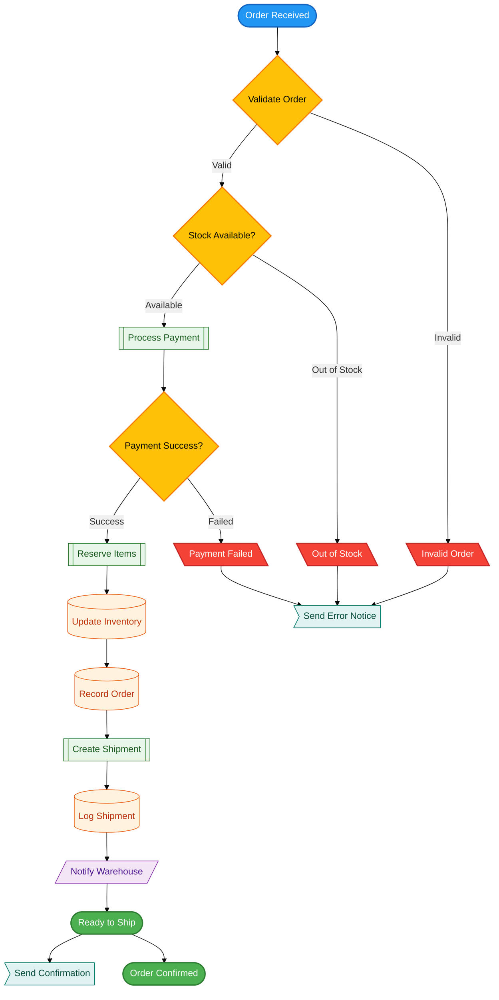

# Example: Business Process - Order Fulfillment

Example of semantic color system applied to a typical business process workflow.

## Use Case

E-commerce order fulfillment process from order placement to delivery, showing decision points and error handling.

## Diagram

## Color Choices Explained

### States
- **Start** → Info (blue): Entry point
- **Success/Ready** → Operational (green): Successful completion
- **Errors** → Error (red): Critical failures (invalid, no stock, payment failed)

### Decision Points
- **All decisions** → Warning (yellow): Points requiring attention/validation

### Architectural Layers
- **Processing** (green light): Business logic (payment, reserve, create shipment)
- **Storage** (orange light): Database operations (inventory, orders, shipments)
- **Communication** (purple light): External integrations (warehouse notification)
- **Presentation** (cyan light): User-facing notifications

## Pattern Highlights

### Decision Diamond Pattern

All decision points (diamond shape `{}`) use warning color (yellow):
- Immediate visual: "Something is being decided here"
- Consistent across diagram
- Branches labeled clearly (Valid/Invalid, Yes/No)

### Error Handling Grouping

All error nodes:
- Use trapezoid shape `[\Error\]` (visual consistency)
- Use error color (red) (semantic meaning)
- Converge to single notification point (DRY)

### Layer Separation

Process nodes (green light) → Storage nodes (orange light) → Communication (purple light)
- Visual flow follows architectural flow
- Easy to identify which layer you're looking at
- Helps spot architectural issues (e.g., skipping layers)

## Adapting This Example

For your business process:
1. Replace steps with your process (validate, payment, shipping, etc.)
2. Identify your decision points (stock check, approval, etc.)
3. Map error paths specific to your domain
4. Keep color system (meaning stays consistent)
5. Adjust labels to your business language

## Learnings

1. **Yellow = Decision**: Makes all decision points stand out immediately
2. **Red = Error**: Error paths instantly identifiable
3. **Layers by color**: Architecture visible at a glance
4. **Consistency = Clarity**: Same colors = same meaning = faster comprehension

---

*This example shows how semantic colors make business process flows immediately clear and actionable.*
