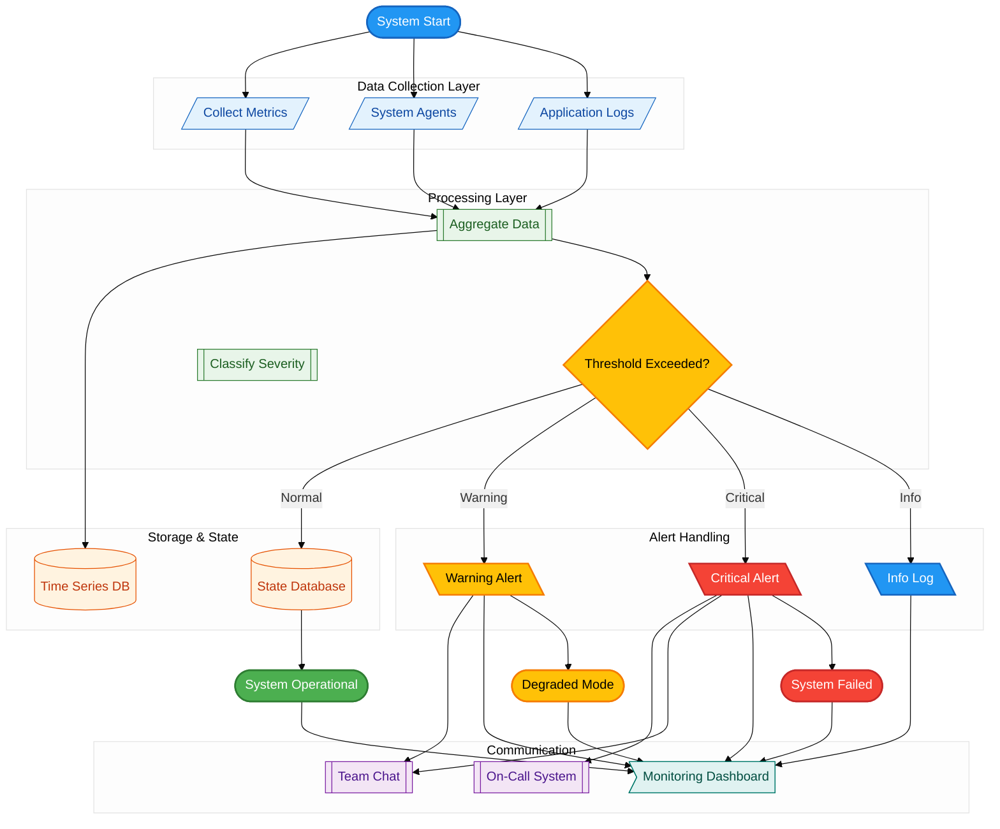

# Example: Critical System Monitoring

Real-world example of semantic color system applied to a 24x7 critical system architecture.

## Use Case

Monitoring and alerting system for mission-critical services that must maintain 99.9% uptime.

## Diagram

## Color Choices Explained

### States

- **Start** → Info (blue): Entry point, neutral
- **Success** → Operational (green): System working correctly
- **Degraded** → Warning (yellow): Attention needed, not critical
- **Failed** → Error (red): Critical failure

### Architectural Layers

- **Sensors/Agents/Logs** → Data layer (blue light): Data ingestion
- **Aggregate/Classify** → Processing layer (green light): Business logic
- **Databases** → Storage layer (orange light): Persistence
- **PagerDuty/Slack** → Communication layer (purple light): Integration
- **Dashboard** → Presentation layer (cyan light): Visualization

### Alert Types

- **Critical** → Error (red): Requires immediate action
- **Warning** → Warning (yellow): Attention needed
- **Info** → Info (blue): Informational only

## Key Takeaways

1. **Colors communicate severity**: Red=critical, yellow=warning, green=OK
2. **Layers separate concerns**: Data → Process → Store → Communicate → Present
3. **Consistency aids understanding**: Same color = same meaning across all diagrams
4. **Semantic names**: TimeSeriesDB clearer than DB1

## Adapting This Example

To use for your system:

1. Replace layer names with your components
2. Adjust alert severity thresholds to your needs
3. Modify communication channels to your stack
4. Keep color system intact (meaning stays consistent)

---

*This example shows how semantic colors make critical system architecture immediately understandable.*
