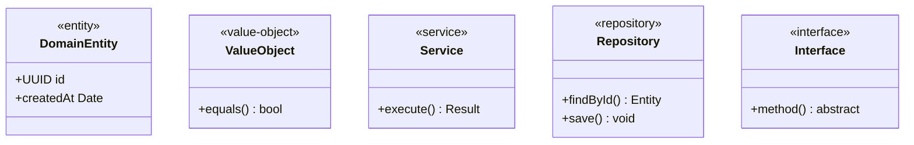
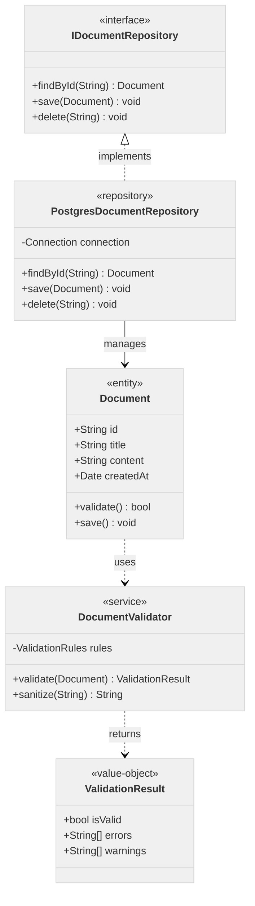
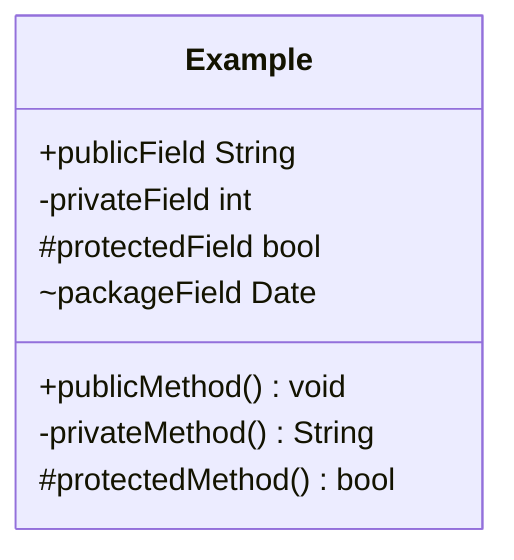

# 🏗️ Class Diagrams - Mermaid

Class diagrams for OOP structures, data models, and system architecture.

## ✅ Styling Capabilities

| Feature | Support | Notes |
|---------|---------|-------|
| Class definitions | ✅ Complete | Properties and methods |
| Relationships | ✅ Complete | Inheritance, composition, association |
| Stereotypes | ✅ Complete | <<interface>>, <<abstract>>, etc. |
| Visibility | ✅ Complete | +public, -private, #protected |
| Annotations | ✅ Complete | Notes and labels |
| Namespaces | ⚠️ Limited | Can use subgraph-like grouping |

## 📐 Relationship Types

| Relationship | Syntax | Visual | Meaning |
|--------------|--------|--------|---------|
| Inheritance | `<\|--` | `─▷` | Extends/implements |
| Composition | `*--` | `─◆` | Strong ownership |
| Aggregation | `o--` | `─◇` | Weak ownership |
| Association | `-->` | `─→` | Uses/knows |
| Dependency | `..>` | `┄→` | Depends on |
| Realization | `..\|>` | `┄▷` | Implements interface |

## 🎨 Semantic Class Stereotypes

### Common Stereotypes

### Stereotype Categories

- `<<entity>>`: Domain entities (mutable, identity)
- `<<value-object>>`: Value objects (immutable, equality by value)
- `<<service>>`: Business logic/services
- `<<repository>>`: Data access layer
- `<<interface>>`: Contracts/interfaces
- `<<abstract>>`: Abstract classes
- `<<concrete>>`: Concrete implementations
- `<<factory>>`: Factory patterns
- `<<singleton>>`: Singleton patterns

## 📋 Complete Example

## 🔍 Visibility Modifiers

| Symbol | Visibility | Meaning |
|--------|------------|---------|
| `+` | Public | Accessible from anywhere |
| `-` | Private | Accessible only within class |
| `#` | Protected | Accessible in class and subclasses |
| `~` | Package | Accessible within package |

## 💡 Best Practices

1. **Semantic Names**: Use domain language (Invoice, not Doc1)
2. **Stereotypes**: Clarify purpose with stereotypes
3. **Visibility**: Use appropriate visibility modifiers
4. **Relationships**: Choose correct relationship type (composition vs association)
5. **Grouping**: Use namespaces/packages for large models
6. **Limit Scope**: Show 5-10 classes max per diagram

## 🚫 Common Pitfalls

- **Generics with commas**: `List<K, V>` not supported (use `List~K,V~` or avoid)
- **Reserved keywords**: Avoid "class", "end" as class names
- **Method overloading**: Show only representative signature
- **Deep hierarchies**: Flatten or split into multiple diagrams

See [`common-pitfalls.md`](./common-pitfalls.md) for complete list.

---

*For other diagram types, see other guides in this directory.*
