# 🚫 Common Pitfalls and Reserved Keywords - Mermaid

This guide documents reserved keywords, special characters, and common syntax errors that break Mermaid diagrams.

## 🔒 Reserved Keywords by Diagram Type

### Flowchart/Graph Diagrams

**Reserved keywords** (avoid as node IDs):

- `end` (lowercase) - Breaks parsing completely
- `class` - Conflicts with classDef
- `style` - Conflicts with style directives
- `click` - Conflicts with click events
- `graph` - Conflicts with graph type
- `subgraph` - Conflicts with subgraph directive

**Workarounds**:

```mermaid
%% ❌ WRONG
graph TD
end[Finish]  %% BREAKS - "end" is reserved
```

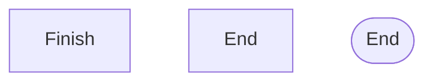

**Node ID edge cases**:

- IDs starting with `o` or `x` create unintended edge types (circle/cross)

```mermaid
  %% ❌ Can cause issues
graph TD
    oNode[Operational]
%% 'o' at start
    xNode[Exit]         %% 'x' at start
```

```mermaid
  %% ✅ BETTER
graph TD
    OpNode[Operational]
    ExitNode[Exit]
  ```

---

### Sequence Diagrams

**Reserved keywords**:

- `end` (in certain contexts)
- `loop`, `alt`, `opt`, `par` (control flow - use correctly)
- `activate`, `deactivate` (must balance)

**Common errors**:

1. **Unbalanced activation**:

```mermaid
%% ❌ WRONG
sequenceDiagram
    A ->> B: Call
    activate B
%% Missing deactivate - can cause issues
```

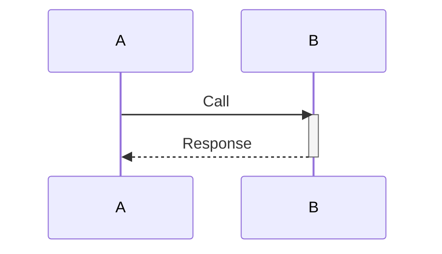

2. **Nested rect blocks** (NOT supported):

```mermaid
%% ‚ùå WRONG
sequenceDiagram
    rect rgb(0,0,0)
        rect rgb(255,0,0) %% Nesting NOT supported
            A ->> B: Call
        end
    end
```

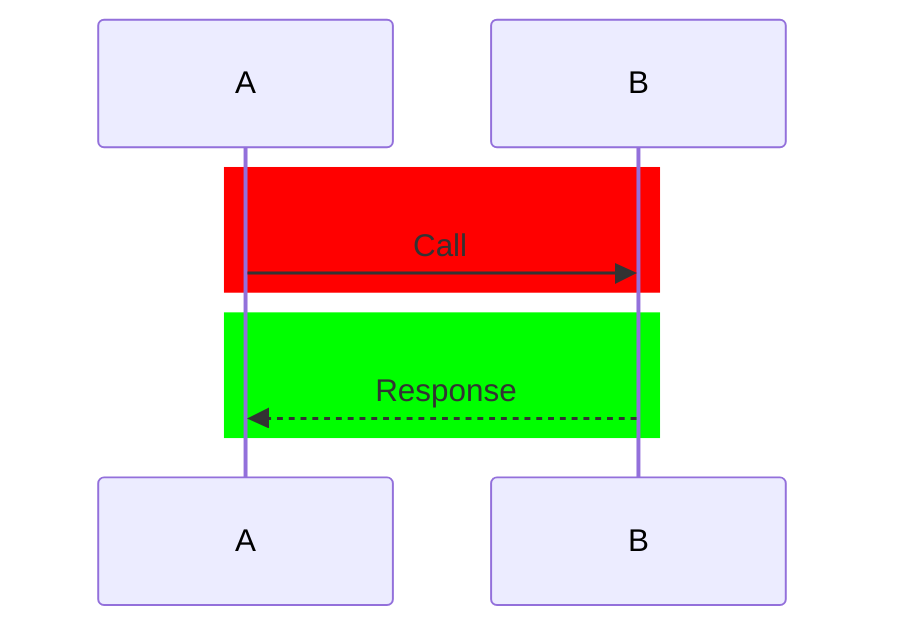

---

### Class Diagrams

**Reserved keywords**:

- `class` (in some contexts)
- `namespace` (conflicts with namespace directive)
- `return` (method name can conflict)

**Naming restrictions**:

1. **Generics with commas** (NOT supported):

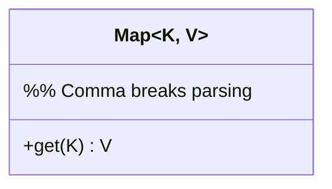

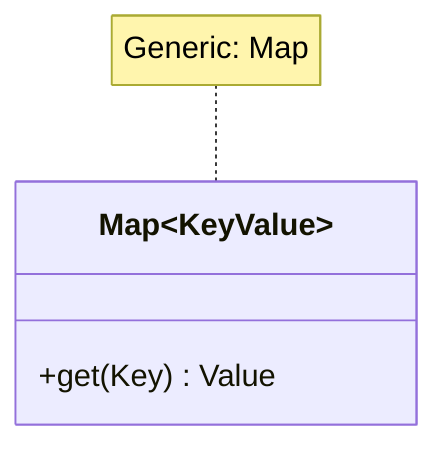

2. **Special characters in class names**:

```mermaid
%% ❌ WRONG
classDiagram
    class My-Class  %% Hyphen breaks
class My: Class %% Colon breaks
```

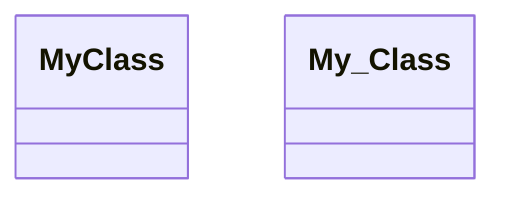

---

### State Diagrams

**Reserved keywords**:

- `state` (in certain contexts)
- `end` (lowercase)
- `[*]` (special - initial/final state marker)

**Transition limitations**:

1. **Cannot transition between internal states of different composite states**:

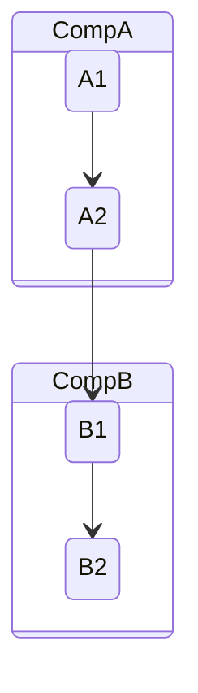

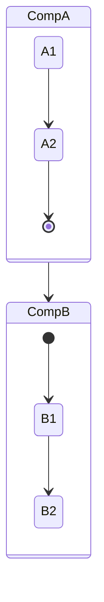

---

### ER Diagrams

**Naming**:

- Entity names: UPPERCASE recommended
- Attribute names: camelCase or snake_case
- Unicode supported with quotes: `"Entité"`

**Cardinality markers** (two-character):

- `||` exactly one
- `o|` zero or one
- `}o` zero or many
- `}|` one or many

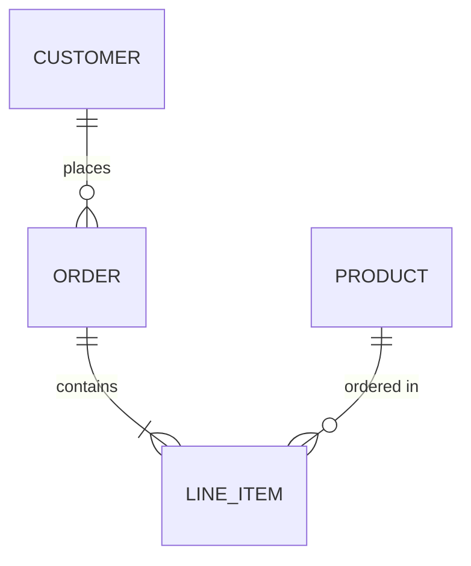

---

## 🎨 classDef and Styling Limitations by Diagram Type

### Critical Limitation: classDef Support

**NOT all diagram types support `classDef` and `class` directives.**

| Diagram Type | Supports `classDef` | Supports `class` | Alternative Styling |
|--------------|--------------------|-----------------|--------------------|
| `flowchart`/`graph` | ✅ Yes | ✅ Yes | `classDef` + `class` or `:::` |
| `sequenceDiagram` | ❌ **NO** | ❌ **NO** | Global theme only |
| `classDiagram` | ❌ **NO** | ❌ **NO** | Built-in styling |
| `stateDiagram` | ⚠️ **Limited** | ⚠️ **Limited** | Theme + `:::` for normal states (not [*] or composite) |
| `erDiagram` | ❌ **NO** | ❌ **NO** | Built-in styling |

### Sequence Diagram Styling

**❌ WRONG - classDef NOT supported:**

```mermaid
sequenceDiagram
    participant User
    participant API

    User->>API: Request
    API-->>User: Response

    %% ❌ THIS BREAKS - classDef not supported in sequenceDiagram
    classDef operational fill:#4CAF50
    class API operational
```

**✅ CORRECT - Use global theme:**

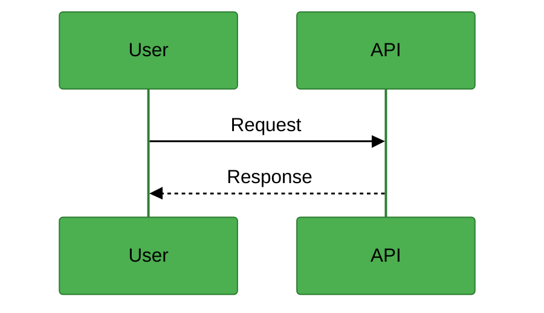

### When to Apply Semantic Colors

**Only use `classDef` and `class` in flowchart/graph diagrams:**

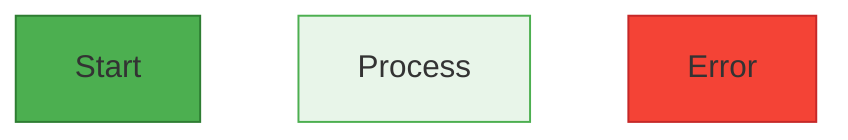

**For other diagram types, rely on theme configuration for semantic colors.**

---

### State Diagram Styling (Limited Support)

**Status**: ⚠️ Partially supported with limitations

**What works** ✅:

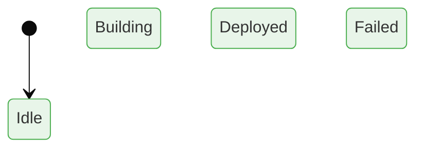

**Limitations** ⚠️:
- ❌ Cannot apply to start/end states `[*]`
- ❌ Cannot apply to composite states
- ⚠️ May not work in older Mermaid versions (<10.0)
- ⚠️ Theme configuration is more reliable across versions

**Recommendation**:
- **Primary method**: Use theme configuration with semantic colors
- **Optional enhancement**: Add `:::className` for normal states
- **Best practice**: Test rendering in your Mermaid version before using `:::`

**Reference**: https://mermaid.js.org/syntax/stateDiagram.html

---

## 🔄 Sequence Diagram Activation/Deactivation

### Critical Issue: Activation in alt/else Blocks

**Common error**: "Trying to inactivate an inactive participant"

**Cause**: Using `-` deactivation suffix inside BOTH branches of an `alt`/`else` block. Only ONE branch executes at runtime, so the first branch's deactivation prevents the second branch from deactivating.

### ❌ WRONG - Deactivation in Both Branches

```mermaid
sequenceDiagram
    User->>+API: Request
    API->>+Service: Process
    Service->>+Database: Query

    alt Success
        Database-->>-Service: Data found
        Service-->>-API: OK
        API-->>-User: 200
    else Error
        Database-->>-Service: Not found  %% ❌ ERROR: Already deactivated!
        Service-->>-API: Error           %% ❌ ERROR: Already deactivated!
        API-->>-User: 500                %% ❌ ERROR: Already deactivated!
    end
```

**Error**: "Trying to inactivate an inactive participant (Database/Service/API)"

### ✅ CORRECT - Solution 1: Deactivate After Block

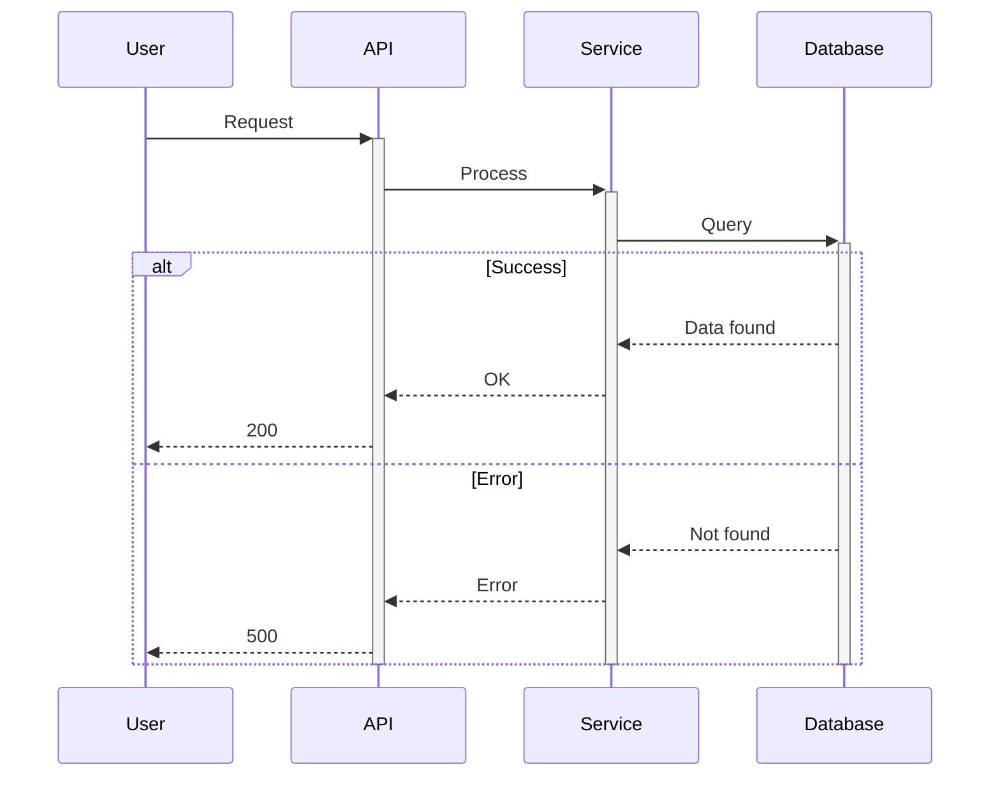

**Explanation**: Activate with `+` before the block, return without `-` inside branches, then explicitly `deactivate` after the block ends.

### ✅ CORRECT - Solution 2: No Activation

```mermaid
sequenceDiagram
    User->>API: Request
    API->>Service: Process
    Service->>Database: Query

    alt Success
        Database-->>Service: Data found
        Service-->>API: OK
        API-->>User: 200
    else Error
        Database-->>Service: Not found
        Service-->>API: Error
        API-->>User: 500
    end
```

**Explanation**: Simpler approach - don't use activation boxes at all. This works for most diagrams where activation timing isn't critical.

### ✅ CORRECT - Solution 3: Selective Activation

```mermaid
sequenceDiagram
    User->>API: Request
    API->>Service: Process

    activate Service
    Note over Service: Critical processing<br/>with activation box

    alt Success
        Service-->>API: OK
        API-->>User: 200
    else Error
        Service-->>API: Error
        API-->>User: 500
    end

    deactivate Service
```

**Explanation**: Use activation only for critical processing sections, deactivate after the decision block.

### General Rules for Activation

1. **NEVER** use `-` deactivation suffix inside `alt`, `else`, `loop`, `opt`, or `par` blocks
2. **Always** balance activations: each `+` needs exactly one `-` or explicit `deactivate`
3. **Deactivate after** control flow blocks, not inside them
4. **Simplify**: If activation doesn't add clarity, don't use it
5. **Explicit is better**: Prefer explicit `activate`/`deactivate` statements over `+`/`-` suffixes for complex flows

### Activation Syntax Options

| Syntax | Description | Use Case |
|--------|-------------|----------|
| `A->>+B: msg` | Activate B inline | Simple linear flows |
| `B-->>-A: msg` | Deactivate B inline | Simple linear flows |
| `activate B` | Explicit activation | Complex flows with branches |
| `deactivate B` | Explicit deactivation | After control blocks |

**Recommendation**: For diagrams with `alt`/`else`/`loop`, use explicit `activate`/`deactivate` statements instead of `+`/`-` suffixes.

---

## ⚠️ Special Characters Issues

### Characters that Break Syntax

| Character        | Issue                            | Solution                                  |
|------------------|----------------------------------|-------------------------------------------|
| `:`              | Breaks in labels                 | Use `\:` or avoid                         |
| `::`             | Conflicts with class application | Use quotes `"text :: text"`               |
| `{}`             | Can conflict with decision nodes | Escape or use quotes                      |
| `[]`             | Can conflict with shape syntax   | Use quotes for text                       |
| Single quote `'` | String delimiter issue           | Use double quotes `"`                     |
| `<` `>`          | Can break in some contexts       | Use HTML entities `&lt;` `&gt;` or quotes |

### Safe Text Handling

```mermaid
%% ❌ PROBLEMATIC
graph TD
    A[Status: Active]
%% Colon may break
```

```mermaid
%% ✅ SAFE
graph TD
    A["Status: Active"]
%% Quoted
    B[Status - Active]
%% Use hyphen instead
    C["Status &colon; Active"]
%% HTML entity
```

---

## 🔧 Common Syntax Breaking Patterns

### 1. Comments Must Be Dedicated Lines

```mermaid
%% ❌ WRONG
graph TD
    A[Node] --> B[Node]  %% Inline comment NOT supported
```

```mermaid
%% ✅ CORRECT
graph TD
%% This is a comment on its own line
    A[Node] --> B[Node]
```

### 2. Subgraph Direction Inheritance

```mermaid
graph TD  %% Top-Down parent
    subgraph Sub
    %% Inherits TD when nodes link externally
    %% Use explicit direction LR to override
        direction LR
        A --> B
    end
```

### 3. ClassDef Must Come After Nodes

```mermaid
%% ❌ WRONG ORDER
graph TD
    classDef myClass fill: #f00 
%% Defined before nodes
    A[Node]:::myClass
```

```mermaid
%% ✅ CORRECT ORDER
graph TD
    A[Node]:::myClass
    classDef myClass fill: #f00
%% Defined after nodes
```

### 4. Reserved Shape Syntax

```mermaid
%% Some shape combinations don't work as expected
%% Always test or use templates
graph TD

%% ✅ SAFE SHAPES
    idRectangle[Rectangle]
    idRounded([Rounded])
    idDiamond{Diamond}
    idCylinder[(Cylinder)]
    idSubroutine[[Subroutine]]
    idCircle((Circle))
```

---

### 4. Subgraph Style Requires ID (not quoted string)

```mermaid
%% ❌ BREAKS - Cannot style quoted string directly
flowchart TD
    subgraph "My Layer"
        A[Node]
    end

    style "My Layer" fill: #f00
%% ERROR: Cannot reference quoted string
```

```mermaid
%% ✅ CORRECT - Use ID with label
flowchart TD
    subgraph MyLayer["My Layer"]
        A[Node]
    end

    style MyLayer fill: #f00
%% Reference ID (no quotes)
```

**Issue**: `style` directive requires identifier (no spaces, no quotes). Cannot reference `"String with spaces"`
directly.

**Solution**:

- Subgraph syntax: `subgraph IDnoSpaces["Label to Display"]`
- Style reference: `style IDnoSpaces fill:...` (use ID, not label)

**Pattern**:

```
subgraph CamelCaseID["Human Readable Label"]
style CamelCaseID [properties]
```

---

### 5. Style Statements After Multi-Connections

```mermaid
%% ❌ MAY BREAK
flowchart TD
    A & B --> C & D
    style A fill: #f00
%% Parser may expect another & connection
```

```mermaid
%% ✅ SAFER - Add blank line
flowchart TD
    A & B --> C & D
    style A fill: #f00
%% Blank line helps parser
```

**Issue**: After `&` multi-connections, parser may expect continuation.

**Workaround**: Add blank line before style statements.

---

## 🛠️ Debugging Tips

1. **Start simple**: Comment out sections to isolate issue
2. **Check syntax**: One syntax error breaks entire diagram
3. **Use templates**: Start from working template
4. **Test incrementally**: Add nodes one at a time
5. **Validate online**: Use [Mermaid Live Editor](https://mermaid.live)
6. **Blank lines matter**: Add blank line before style/classDef after complex connections

## 📚 Additional Resources

- [Official Mermaid Docs](https://mermaid.js.org/)
- [Mermaid GitHub Issues](https://github.com/mermaid-js/mermaid/issues)
- [Mermaid Live Editor](https://mermaid.live) (for testing)

---

*This guide is actively maintained. PRs welcome for additional pitfalls discovered.*
