# 🚫 Common Pitfalls and Reserved Keywords - Mermaid

This guide documents reserved keywords, special characters, and common syntax errors that break Mermaid diagrams.

## 🔒 Reserved Keywords by Diagram Type

### Flowchart/Graph Diagrams

**Reserved keywords** (avoid as node IDs):

- `end` (lowercase) - Breaks parsing completely
- `class` - Conflicts with classDef
- `style` - Conflicts with style directives
- `click` - Conflicts with click events
- `graph` - Conflicts with graph type
- `subgraph` - Conflicts with subgraph directive

**Workarounds**:

```mermaid
%% ❌ WRONG
graph TD
end[Finish]  %% BREAKS - "end" is reserved
```


**Node ID edge cases**:

- IDs starting with `o` or `x` create unintended edge types (circle/cross)

```mermaid
  %% ❌ Can cause issues
graph TD
    oNode[Operational]
%% 'o' at start
    xNode[Exit]         %% 'x' at start
```

```mermaid
  %% ✅ BETTER
graph TD
    OpNode[Operational]
    ExitNode[Exit]
  ```

---

### Sequence Diagrams

**Reserved keywords**:

- `end` (in certain contexts)
- `loop`, `alt`, `opt`, `par` (control flow - use correctly)
- `activate`, `deactivate` (must balance)

**Common errors**:

1. **Unbalanced activation**:

```mermaid
%% ❌ WRONG
sequenceDiagram
    A ->> B: Call
    activate B
%% Missing deactivate - can cause issues
```

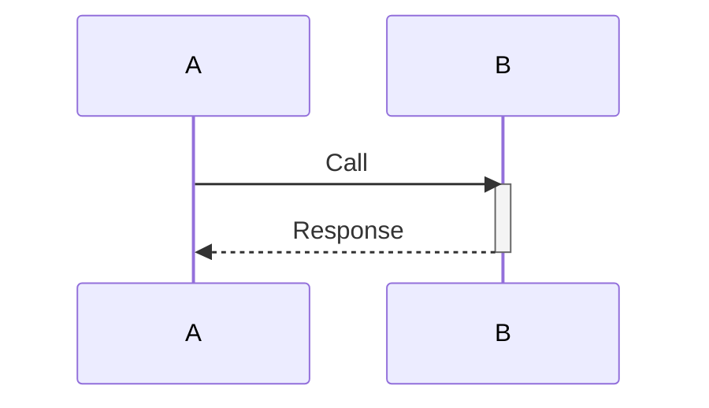

2. **Nested rect blocks** (NOT supported):

```mermaid
%% ‚ùå WRONG
sequenceDiagram
    rect rgb(0,0,0)
        rect rgb(255,0,0) %% Nesting NOT supported
            A ->> B: Call
        end
    end
```

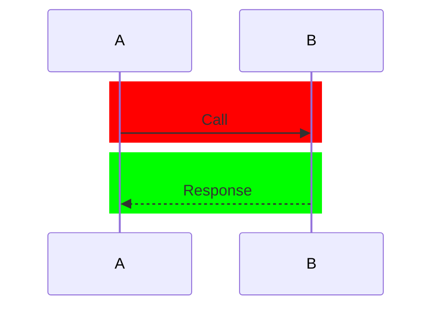

---

### Class Diagrams

**Reserved keywords**:

- `class` (in some contexts)
- `namespace` (conflicts with namespace directive)
- `return` (method name can conflict)

**Naming restrictions**:

1. **Generics with commas** (NOT supported):

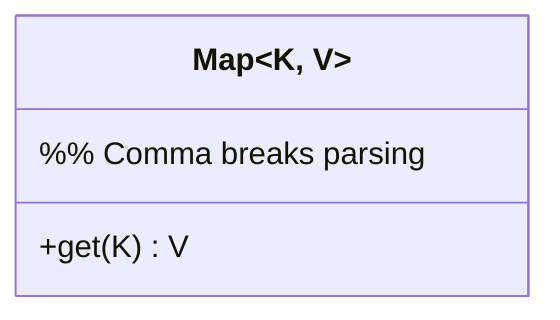

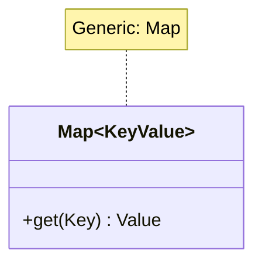

2. **Special characters in class names**:

```mermaid
%% ❌ WRONG
classDiagram
    class My-Class  %% Hyphen breaks
class My: Class %% Colon breaks
```

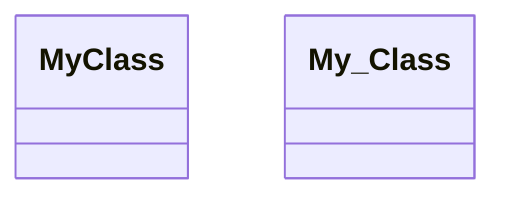

---

### State Diagrams

**Reserved keywords**:

- `state` (in certain contexts)
- `end` (lowercase)
- `[*]` (special - initial/final state marker)

**Transition limitations**:

1. **Cannot transition between internal states of different composite states**:

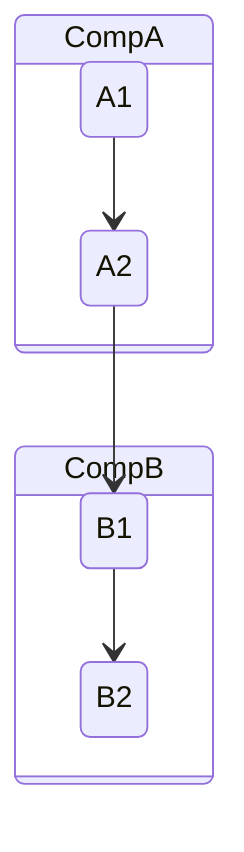

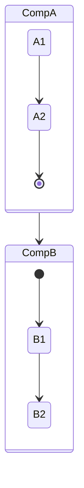

---

### ER Diagrams

**Naming**:

- Entity names: UPPERCASE recommended
- Attribute names: camelCase or snake_case
- Unicode supported with quotes: `"Entité"`

**Cardinality markers** (two-character):

- `||` exactly one
- `o|` zero or one
- `}o` zero or many
- `}|` one or many

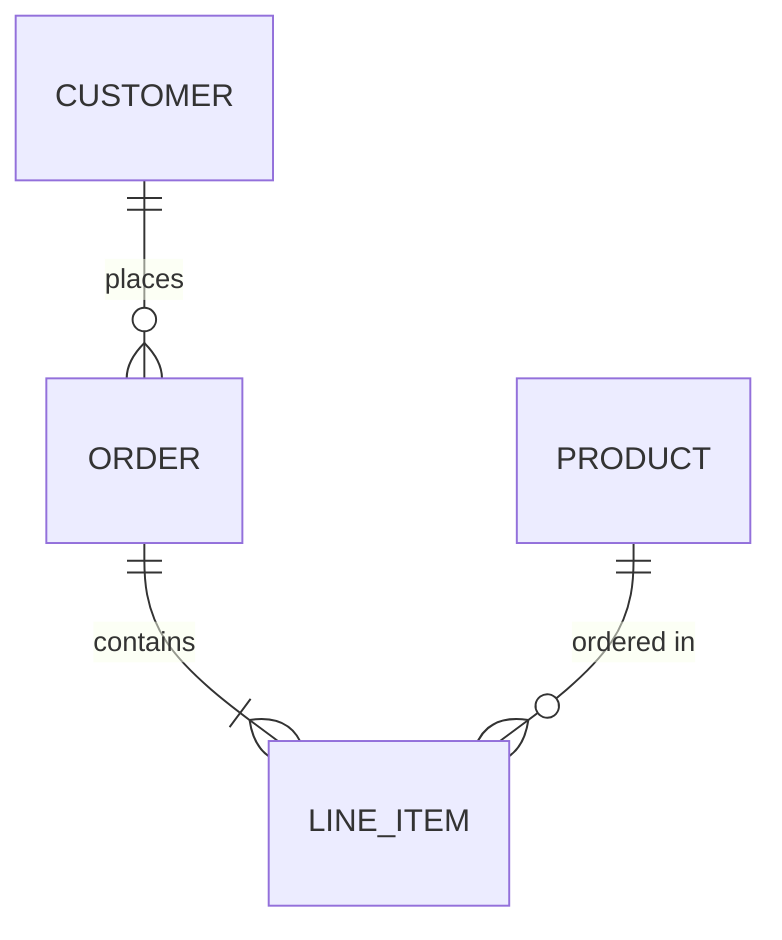

---

## ⚠️ Special Characters Issues

### Characters that Break Syntax

| Character        | Issue                            | Solution                                  |
|------------------|----------------------------------|-------------------------------------------|
| `:`              | Breaks in labels                 | Use `\:` or avoid                         |
| `::`             | Conflicts with class application | Use quotes `"text :: text"`               |
| `{}`             | Can conflict with decision nodes | Escape or use quotes                      |
| `[]`             | Can conflict with shape syntax   | Use quotes for text                       |
| Single quote `'` | String delimiter issue           | Use double quotes `"`                     |
| `<` `>`          | Can break in some contexts       | Use HTML entities `&lt;` `&gt;` or quotes |

### Safe Text Handling

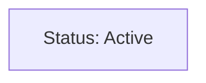

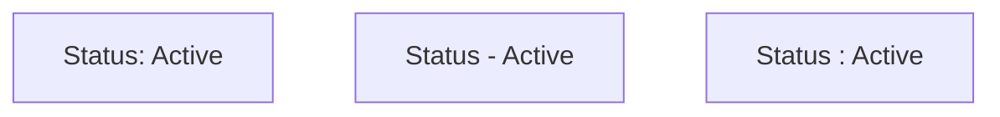

---

## 🔧 Common Syntax Breaking Patterns

### 1. Comments Must Be Dedicated Lines

```mermaid
%% ❌ WRONG
graph TD
    A[Node] --> B[Node]  %% Inline comment NOT supported
```

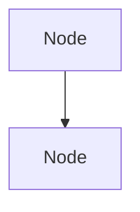

### 2. Subgraph Direction Inheritance

```mermaid
graph TD  %% Top-Down parent
    subgraph Sub
    %% Inherits TD when nodes link externally
    %% Use explicit direction LR to override
        direction LR
        A --> B
    end
```

### 3. ClassDef Must Come After Nodes

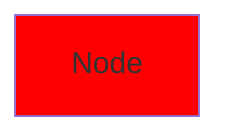

```mermaid
%% ✅ CORRECT ORDER
graph TD
    A[Node]:::myClass
    classDef myClass fill: #f00
%% Defined after nodes
```

### 4. Reserved Shape Syntax

```mermaid
%% Some shape combinations don't work as expected
%% Always test or use templates
graph TD

%% ✅ SAFE SHAPES
    idRectangle[Rectangle]
    idRounded([Rounded])
    idDiamond{Diamond}
    idCylinder[(Cylinder)]
    idSubroutine[[Subroutine]]
    idCircle((Circle))
```

---

### 4. Subgraph Style Requires ID (not quoted string)

```mermaid
%% ❌ BREAKS - Cannot style quoted string directly
flowchart TD
    subgraph "My Layer"
        A[Node]
    end

    style "My Layer" fill: #f00
%% ERROR: Cannot reference quoted string
```

```mermaid
%% ✅ CORRECT - Use ID with label
flowchart TD
    subgraph MyLayer["My Layer"]
        A[Node]
    end

    style MyLayer fill: #f00
%% Reference ID (no quotes)
```

**Issue**: `style` directive requires identifier (no spaces, no quotes). Cannot reference `"String with spaces"`
directly.

**Solution**:

- Subgraph syntax: `subgraph IDnoSpaces["Label to Display"]`
- Style reference: `style IDnoSpaces fill:...` (use ID, not label)

**Pattern**:

```
subgraph CamelCaseID["Human Readable Label"]
style CamelCaseID [properties]
```

---

### 5. Style Statements After Multi-Connections

```mermaid
%% ❌ MAY BREAK
flowchart TD
    A & B --> C & D
    style A fill: #f00
%% Parser may expect another & connection
```

```mermaid
%% ✅ SAFER - Add blank line
flowchart TD
    A & B --> C & D
    style A fill: #f00
%% Blank line helps parser
```

**Issue**: After `&` multi-connections, parser may expect continuation.

**Workaround**: Add blank line before style statements.

---

## 🛠️ Debugging Tips

1. **Start simple**: Comment out sections to isolate issue
2. **Check syntax**: One syntax error breaks entire diagram
3. **Use templates**: Start from working template
4. **Test incrementally**: Add nodes one at a time
5. **Validate online**: Use [Mermaid Live Editor](https://mermaid.live)
6. **Blank lines matter**: Add blank line before style/classDef after complex connections

## 📚 Additional Resources

- [Official Mermaid Docs](https://mermaid.js.org/)
- [Mermaid GitHub Issues](https://github.com/mermaid-js/mermaid/issues)
- [Mermaid Live Editor](https://mermaid.live) (for testing)

---

*This guide is actively maintained. PRs welcome for additional pitfalls discovered.*
