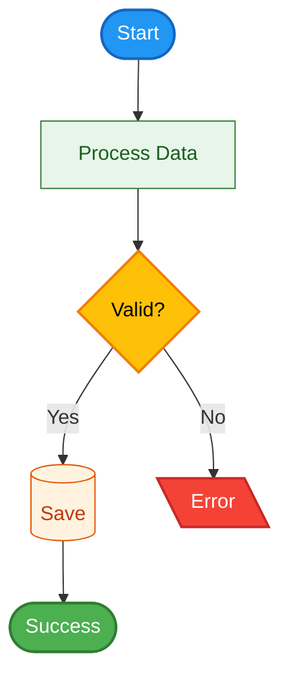
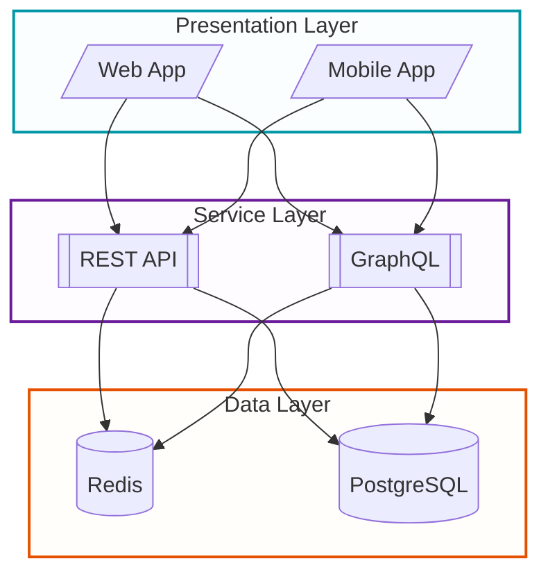

# 📊 Flowchart / Graph Diagrams - Mermaid

The most versatile diagram type with complete styling support in Mermaid.

## ✅ Styling Capabilities

| Feature           | Support       | Notes                      |
|-------------------|---------------|----------------------------|
| classDef          | ✅ Complete    | All properties work        |
| Custom shapes     | ✅ 12+ shapes  | Largest variety            |
| Individual colors | ✅ Total       | Per node, subgraph, etc.   |
| Line styles       | ✅ Complete    | Solid, dotted, thick       |
| Subgraphs         | ✅ Complete    | With own styles            |
| Directionality    | ✅ TD/LR/BT/RL | Top-Down, Left-Right, etc. |

## 🔷 Shape Mapping

### Available Shapes and Syntax

| Semantic Shape      | Mermaid Syntax | Visual           | Use Case                  |
|---------------------|----------------|------------------|---------------------------|
| `shape.process`     | `id[text]`     | `[Process]`      | Standard process/activity |
| `shape.state`       | `id(text)`     | `(State)`        | State or event            |
| `shape.decision`    | `id{text}`     | `{Decision}`     | Decision point            |
| `shape.input`       | `id[/text/]`   | `[/Input/]`      | Data input                |
| `shape.output`      | `id[\text\]`   | `[\Output\]`     | Data output               |
| `shape.storage`     | `id[(text)]`   | `[(Database)]`   | Database/storage          |
| `shape.api`         | `id[[text]]`   | `[[Subroutine]]` | API call/function         |
| `shape.connector`   | `id((text))`   | `((Circle))`     | Connector/join            |
| `shape.preparation` | `id{{text}}`   | `{{Hexagon}}`    | Preparation step          |
| `shape.terminal`    | `id([text])`   | `([Terminal])`   | Start/End                 |
| `shape.document`    | `id[/text\]`   | `[/Document\]`   | Document (trapezoid)      |
| `shape.manual`      | `id[\text/]`   | `[\Manual/]`     | Manual process            |
| `shape.display`     | `id>text]`     | `>Display]`      | Display/screen            |

## 🎨 Applying Semantic Colors

### Complete Template

See `/templates/flowchart.mmd` for full copy-paste template with all color classes defined.

### Color System Quick Reference

**States**:

- `operational` → Green (#4CAF50): Working correctly
- `warning` → Yellow (#FFC107): Degraded/attention needed
- `error` → Red (#F44336): Failed/critical
- `info` → Blue (#2196F3): Informational
- `inactive` → Gray (#9E9E9E): Disabled/unused

**Architectural Layers**:

- `dataLayer` → Blue light: Input/sensors/sources
- `processingLayer` → Green light: Logic/transformation
- `storageLayer` → Orange light: Persistence/database
- `communicationLayer` → Purple light: APIs/messaging
- `presentationLayer` → Cyan light: UI/visualization

**Priority Levels**:

- `critical` → Red border 3px: Critical systems
- `important` → Orange border 2px: Important components
- `standard` → Blue border 1px: Standard components

### Usage Example

## 🔗 Line Styles and Connections

```mermaid
flowchart LR
    A[Node A] --> B[Node B]
%% Solid line with arrow
    B --- C[Node C]
%% Solid line without arrow
    C -.-> D[Node D]
%% Dotted line with arrow
    D -.- E[Node E]
%% Dotted line without arrow
    E ==> F[Node F]
%% Thick line with arrow
    F === G[Node G]
%% Thick line without arrow

%% With labels
    G -->|Label| H[Node H]
    H -.->|Text| I[Node I]
    I ==>|Important| J[Node J]
```

## 🏗️ Subgraphs and Grouping

### Styled Subgraphs

## 💡 Best Practices

1. **Semantic Naming**: Use meaningful names (SessionStart, not A)
2. **Visual Consistency**: Apply consistent classes to similar nodes
3. **Flow Direction**: Maintain consistent flow direction (TD for workflows, LR for pipelines)
4. **Comments**: Include comments explaining complex parts
5. **Modularity**: Split complex diagrams into multiple simpler ones
6. **Avoid Overload**: Don't include too many elements in single diagram

## 🚫 Common Pitfalls

See [`common-pitfalls.md`](./common-pitfalls.md) for:

- Reserved keywords to avoid
- Special characters handling
- Common syntax errors and fixes

---

*For more diagram types, see other guides in this directory.*
