# 📊 Sequence Diagrams - Mermaid

Sequence diagrams show interactions between components over time.

## ✅ Styling Capabilities

| Feature             | Support    | Notes                   |
|---------------------|------------|-------------------------|
| Participants        | ✅ Complete | With aliases and emojis |
| Activation boxes    | ✅ Complete | activate/deactivate     |
| Notes               | ✅ Complete | left of, right of, over |
| Color blocks (rect) | ✅ Complete | RGB color rectangles    |
| Loops/Alt/Opt       | ✅ Complete | Control flow blocks     |
| Autonumbering       | ✅ Complete | Auto-number messages    |

## 🎨 Semantic Colors with rect

Unlike flowcharts, sequence diagrams use `rect rgb()` blocks for colors:

### Color Reference for rect

```
Data Layer (Blue):        rect rgb(227, 242, 253)
Processing (Purple):      rect rgb(243, 229, 245)
Storage (Orange):         rect rgb(255, 243, 224)
Operational (Green):      rect rgb(232, 245, 233)
Warning (Yellow):         rect rgb(255, 248, 225)
Error (Red):              rect rgb(255, 235, 238)
```

## 📋 Complete Template Example

See `/templates/sequence.mmd` for full copy-paste template.

### Basic Structure

```mermaid
sequenceDiagram
    participant User as 👤 User
    participant API as 🔌 API
    participant DB as 🗃️ Database

    rect rgb(227, 242, 253)
        note right of User: DATA INPUT LAYER
        User ->> API: Request data
        activate API
    end

    rect rgb(243, 229, 245)
        note right of API: PROCESSING LAYER
        API ->> DB: Query
        activate DB
        DB -->> API: Results
        deactivate DB
    end

    rect rgb(232, 245, 233)
        note right of API: SUCCESSFUL RESPONSE
        API -->> User: Show results
        deactivate API
    end

    rect rgb(255, 235, 238)
        note right of API: ERROR HANDLING
        API --x User: Critical error
    end
```



## 🔄 Control Flow

### Loops


### Alternative Paths


### Optional Blocks


## 💡 Best Practices

1. **Clear Participants**: Use descriptive names and emojis
2. **Activation Boxes**: Show when components are active
3. **Color Blocks**: Group related interactions by layer/state
4. **Notes**: Add context with notes (right of, left of, over)
5. **Autonumbering**: Enable for complex diagrams (`autonumber`)
6. **Keep It Simple**: Split long sequences into multiple diagrams

## 🚫 Common Pitfalls

- Avoid too many participants (max 5-6 for readability)
- Don't nest rect blocks (not supported)
- Use `-->>` for returns, `->>` for calls
- Activation/deactivation must balance (every activate needs deactivate)

See [`common-pitfalls.md`](./common-pitfalls.md) for more details.

---

*For other diagram types, see other guides in this directory.*
