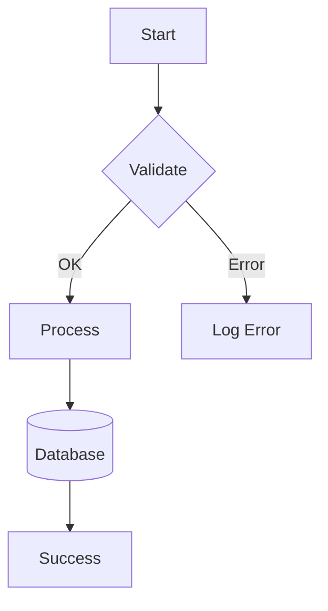

# Test: apply-colors command

## Setup

First, create simple diagram without colors:



Save as: `tests/output/simple-no-colors.mmd`

---

## Prompt

Apply semantic color system to the diagram in `tests/output/simple-no-colors.mmd`.

Identify:
- Start/Success as lifecycle markers (info/operational)
- Validate as decision point (warning)
- Process as business logic (processingLayer)
- Database as persistence (storageLayer)
- Error as failure path (error)

Add complete classDef block and apply classes.

---

## Execution

### Automated (CLI):
```bash
# First create simple diagram
cat > tests/output/simple-no-colors.mmd << 'EOF'
graph TD
    A[Start] --> B{Validate}
    B -->|OK| C[Process]
    B -->|Error| D[Log Error]
    C --> E[(Database)]
    E --> F[Success]
EOF

# Apply colors
claude -p "Apply semantic colors to this diagram: $(cat tests/output/simple-no-colors.mmd). Add classDef and apply classes." \
    --output-format json \
    > tests/output/simple-colored.json

jq -r '.response' tests/output/simple-colored.json > tests/output/simple-colored.mmd
```

---

## Expected Output

Diagram with:
- Semantic node names (Start, Validate, Process, not A, B, C)
- Colors applied (info, warning, error, operational, layers)
- Complete classDef block
- Original logic preserved

## Validation

- [ ] Colors applied correctly
- [ ] Node names improved (semantic)
- [ ] Logic preserved (same flow)
- [ ] classDef complete
- [ ] Renders without errors
